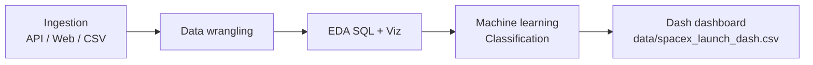

<p align="center">
  <a href="https://www.ibm.com/training" target="_blank" rel="noopener noreferrer">
    
  </a>
</p>

<h1 align="center">IBM Data Science — Capstone Project</h1>
<h3 align="center">SpaceX Falcon 9 — Predicting first-stage landing success</h3>

<p align="center">
  
  
  
  
</p>

<p align="center">
  <a href="#about">About</a> ·
  <a href="#objectives">Objectives</a> ·
  <a href="#notebook-workflow">Notebook workflow</a> ·
  <a href="#repository-contents">Repository</a> ·
  <a href="#dashboard">Dashboard</a> ·
  <a href="#how-to-run">How to run</a> ·
  <a href="#disclaimer">Disclaimer</a>
</p>

---

<a id="about"></a>
## About

This repository contains the **Capstone** for the **IBM Data Science** track on **Coursera** / **IBM Skills Network**. The project analyzes real **SpaceX Falcon 9** launch records with the goal of **predicting whether the first stage lands successfully** — a proxy for booster reuse and **launch cost** competitiveness versus other providers in procurement scenarios.

> **Course context:** *IBM Data Science Professional Certificate* — labs named `jupyter-labs-*` plus the Falcon 9 **Machine Learning** module.

---

<a id="objectives"></a>
## Project objectives

- **Business question:** SpaceX reuses the Falcon 9 first stage; predicting landing success supports estimates of **economic viability** and **risk** when comparing launch providers.
- **Technical goal:** Walk through an end-to-end **data science pipeline** — ingestion, cleaning, **EDA**, SQL, visualization, **supervised ML**, and an **interactive dashboard**.
- **Deliverables:** A **classification model** (see ML notebook) and a **Plotly Dash** app to explore success rates by **launch site** and **payload mass**.



---

<a id="notebook-workflow"></a>
## End-to-end notebook workflow

The labs are meant to be followed **in pipeline order**. Below is what each stage does in practice — from raw signals to a model and presentation layer.

### 1. Data collection — API (`jupyter-labs-spacex-data-collection-api-v2.ipynb`)

- **Ingest** launch metadata from the public **SpaceX REST API** (`requests` + JSON).
- **Normalize** nested JSON into a flat **pandas** table (`json_normalize`).
- **Filter** launches to a consistent scope (e.g. single core / single payload rows, date cutoffs as required by the lab).
- **Enrich** each launch by **chaining API calls** for rocket, launchpad, payload, and core: booster name, lat/long, payload mass and orbit, block, reuse counts, landing outcome text, grid fins, legs, landpad, etc.
- **Output:** a tabular dataset suitable for the next lab (features + outcome information).

### 2. Data collection — web scraping (`jupyter-labs-webscraping.ipynb`)

- **Complement** API data by **scraping** Falcon 9 / Falcon Heavy launch records from **Wikipedia** (course pattern: `BeautifulSoup` / HTML tables).
- **Align** scraped fields with the course schema so records can be merged or validated against the API pipeline.
- **Purpose:** practice alternate ingestion when an API is incomplete or when historical HTML tables are the source of truth.

### 3. Data wrangling (`labs-jupyter-spacex-Data wrangling-v2.ipynb`)

- **Load** the collected dataset and inspect schema, **missing values**, and **dtypes**.
- **Profile** launches: counts by **launch site**, **orbit**, and **mission outcome** strings.
- **Derive the target label:** map raw `Outcome` text to a **binary landing class** (success vs. failure / no landing) for supervised learning.
- **Clean and standardize** columns needed downstream (consistent categories, handling unusable rows).
- **Output:** analysis-ready dataframe with an explicit **label column** for ML.

### 4. EDA with SQL (`jupyter-labs-eda-sql-coursera_sqllite.ipynb`)

- **Load** the wrangled data into **SQLite** (in-notebook or local DB file pattern from the course).
- **Query** with SQL: filters, aggregations, joins-style logic on launch / site / outcome fields.
- **Goal:** answer structured questions (e.g. success rates by site or orbit) and bridge **pandas ↔ SQL** for reporting.

### 5. Exploratory data visualization (`jupyter-labs-eda-dataviz-v2.ipynb`)

- **Visual** EDA with **matplotlib** / **seaborn**: distributions, relationships between **payload**, **orbit**, **launch site**, and **landing success**.
- **Support** hypothesis formation for feature engineering (what separates successful landings).

### 6. Geospatial analysis (`lab-jupyter-launch-site-location-v2.ipynb`)

- **Load** `spacex_launch_geo.csv` (see `data/`) with coordinates and outcome.
- **Map** launch sites and outcomes with **Folium** (markers, clusters, popups).
- **Analyze proximity:** distances from sites to **coastline**, **rail**, **highway**, **city** (haversine-style helpers in the lab).
- **Purpose:** link geographic context to launch success as part of **communicating** results, not only tabular EDA.

### 7. Machine learning — landing prediction (`SpaceX-Machine-Learning-Prediction-Part-5-v1.ipynb`)

- **Preprocess** features: encoding categorical variables, scaling as required (**StandardScaler** pattern from sklearn).
- **Define** feature matrix `X` and target `Y` (landing success class).
- **Split** data: **train/test** (e.g. 80/20 with fixed `random_state`).
- **Tune and compare** classifiers with **GridSearchCV** (e.g. **logistic regression**, **SVM**, **decision tree**, **k-NN**) — hyperparameter grids and **cross-validation** accuracy.
- **Evaluate** on held-out **test** set (`score`, confusion matrices as in the lab).
- **Interpret:** which model performs best for this tabular Falcon 9 subset and how reliable the estimates are for the assignment.

### 8. Interactive dashboard (`dashboard/dashboard_ds.py`)

- Consumes **`data/spacex_launch_dash.csv`** (payload, site, booster version, binary outcome column).
- **Plotly Dash** UI: site filter, pie chart of success mix, payload slider, scatter of payload vs. outcome by booster version.
- Not a training step — it **operationalizes** exploration for stakeholders after the model/EDA work.

> **Path note:** If a notebook still references CSVs in an old root folder, update paths to **`../data/...`** relative to `notebooks/`.

---

<a id="repository-contents"></a>
## Repository contents

| Path | Description |
|------|-------------|
| `notebooks/jupyter-labs-spacex-data-collection-api-v2.ipynb` | API-based data collection |
| `notebooks/jupyter-labs-webscraping.ipynb` | Wikipedia scraping |
| `notebooks/labs-jupyter-spacex-Data wrangling-v2.ipynb` | Wrangling and label creation |
| `notebooks/jupyter-labs-eda-sql-coursera_sqllite.ipynb` | SQL EDA (SQLite) |
| `notebooks/jupyter-labs-eda-dataviz-v2.ipynb` | Exploratory visualization |
| `notebooks/lab-jupyter-launch-site-location-v2.ipynb` | Folium maps and distances |
| `notebooks/SpaceX-Machine-Learning-Prediction-Part-5-v1.ipynb` | ML classification pipeline |
| `dashboard/dashboard_ds.py` | Dash application (CYBORG theme) |

### Data (`data/`)

| File | Notes |
|------|--------|
| `data/spacex_launch_dash.csv` | Dashboard: payload, site, outcome class, etc. |
| `data/spacex_launch_geo.csv` (and variants) | Lat/long and outcomes for mapping |
| `data/dataset_part_2.csv`, `data/dataset_part_3.csv` | Intermediate course datasets |

*(No exported plot images are stored in this repository; charts are produced when you execute the notebooks or run the Dash app.)*

---

<a id="dashboard"></a>
## Dashboard

**`dashboard/dashboard_ds.py`** implements the **SpaceX Launch Records** Dash app:

- **Dropdown** of launch site (or “All Sites”).
- **Pie chart** — success vs. failure mix for the selection.
- **Payload mass slider (kg)** and **scatter plot** — payload vs. outcome (`class`) by booster version.
- **Plotly Dark** + **Dash Bootstrap (CYBORG)** styling.
- If `data/spacex_launch_dash.csv` is missing locally, the script can **download** the public Skills Network dataset into `data/` (URL in code).

---

<a id="how-to-run"></a>
## How to run

### Environment

```bash
cd ibm_capstone
python3 -m venv .venv
source .venv/bin/activate   # Windows: .venv\Scripts\activate
pip install -r requirements.txt
```

### Jupyter

Open notebooks under **`notebooks/`** in JupyterLab or VS Code and run cells in the order indicated by each lab.

### Dash

From the **repository root** (with CSV present or network available for download):

```bash
python dashboard/dashboard_ds.py
```

Then open the URL printed in the terminal (typically `http://127.0.0.1:8050`).

### Repository layout

```
ibm_capstone/
├── dashboard/
│   └── dashboard_ds.py
├── data/
│   ├── spacex_launch_dash.csv
│   ├── spacex_launch_geo*.csv
│   └── dataset_part_*.csv
├── notebooks/
│   └── *.ipynb
├── requirements.txt
└── README.md
```

---

<a id="disclaimer"></a>
## Disclaimer

This work is **educational only**, as part of the IBM / Coursera curriculum. It is **not** financial or engineering advice for real launches or investments. Course exercises simplify reality; any production use would require independent validation.

---

## Credits

- **IBM** — *IBM Data Science* Capstone on **Coursera** and **IBM Skills Network**.
- **Course materials** — official lab datasets and URLs from Skills Network where applicable.
- **Plotly / Dash / Jupyter** — open-source communities.

<p align="center">
  <a href="https://skills.network" target="_blank" rel="noopener noreferrer">
    
  </a>
</p>
