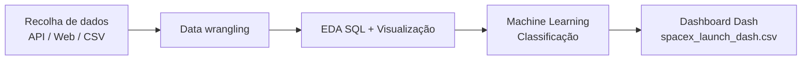

<p align="center">
  <a href="https://www.ibm.com/training" target="_blank" rel="noopener noreferrer">
    
  </a>
</p>

<h1 align="center">Capstone — IBM Data Science</h1>
<h3 align="center">SpaceX Falcon 9 — previsão da aterragem do primeiro estágio</h3>

<p align="center">
  
  
  
  
</p>

<p align="center">
  <a href="#readme-topo">Sobre</a> ·
  <a href="#readme-objetivo">Objetivo</a> ·
  <a href="#readme-conteudo">Repositório</a> ·
  <a href="#readme-dashboard">Dashboard</a> ·
  <a href="#readme-executar">Como executar</a> ·
  <a href="#readme-disclaimer">Disclaimer</a>
</p>

---

<a id="readme-topo"></a>
## Sobre

Este repositório reúne o trabalho do **projeto final (Capstone)** associado à trilha **IBM Data Science** no **Coursera** / **IBM Skills Network**: análise e modelação com dados reais do programa **SpaceX Falcon 9**, com foco em **prever se o primeiro estágio aterra com sucesso** — informação ligada à reutilização do booster e a **custos de lançamento**.

> **Curso de referência (série):** *IBM Data Science Professional Certificate* — laboratórios com prefixo `jupyter-labs-*` e módulo de *Machine Learning* para Falcon 9.

---

<a id="readme-objetivo"></a>
## Objetivo do projeto

- **Problema de negócio:** a SpaceX reutiliza o primeiro estágio do Falcon 9; prever o sucesso da aterragem ajuda a estimar **viabilidade económica** e **risco** relativamente a fornecedores concorrentes em licitações de lançamento.
- **Objetivo técnico:** percorrer o **pipeline completo de ciência de dados** — recolha e limpeza de dados, **EDA**, SQL, visualização, **modelos de machine learning** e **aplicação interativa** (dashboard).
- **Resultado esperado:** um **modelo de classificação** (notebooks de ML) e um **dashboard Plotly Dash** para explorar taxas de sucesso por **local de lançamento** e **massa de payload**.



---

<a id="readme-conteudo"></a>
## Conteúdo do repositório

| Ficheiro | Descrição |
|----------|-----------|
| `jupyter-labs-spacex-data-collection-api-v2.ipynb` | Recolha de dados via API |
| `jupyter-labs-webscraping.ipynb` | Web scraping complementar |
| `labs-jupyter-spacex-Data wrangling-v2.ipynb` | *Data wrangling* e preparação |
| `jupyter-labs-eda-sql-coursera_sqllite.ipynb` | EDA com SQL (SQLite) |
| `jupyter-labs-eda-dataviz-v2.ipynb` | Visualização exploratória |
| `lab-jupyter-launch-site-location-v2.ipynb` | Análise de localizações de lançamento |
| `SpaceX-Machine-Learning-Prediction-Part-5-v1.ipynb` | **Pipeline de ML** — previsão da aterragem |
| `dashboard_ds.py` | **Aplicação Dash** — gráficos pizza e dispersão (tema CYBORG) |

### Dados (CSV)

| Ficheiro | Notas |
|----------|--------|
| `spacex_launch_dash.csv` | Usado pelo dashboard (payload, site, classe de sucesso, etc.) |
| `spacex_launch_geo.csv` / variantes | Dados com componente geográfica |
| `dataset_part_2.csv`, `dataset_part_3.csv` | Conjuntos intermédios ao longo dos labs |

---

<a id="readme-dashboard"></a>
## Dashboard

O ficheiro **`dashboard_ds.py`** implementa o **SpaceX Launch Records Dashboard** com:

- **Dropdown** de local de lançamento (ou “All Sites”).
- **Gráfico circular** — distribuição de sucessos por site ou sucesso vs. falha por site.
- **Slider de massa de payload (kg)** e **gráfico de dispersão** — payload vs. resultado (`class`), por versão do booster.
- Tema visual **Plotly Dark** + **Dash Bootstrap (CYBORG)**.
- Se `spacex_launch_dash.csv` não existir localmente, o script tenta **descarregar** o dataset público do Skills Network (URL no código).

---

<a id="readme-executar"></a>
## Como executar

### Ambiente

```bash
cd ibm_capstone
python3 -m venv .venv
source .venv/bin/activate   # Windows: .venv\Scripts\activate
pip install pandas dash plotly dash-bootstrap-components wget
```

### Jupyter

Abrir os `.ipynb` no Jupyter Lab / VS Code e executar as células na ordem sugerida pelos laboratórios.

### Dashboard Dash

Na raiz do projeto (com `spacex_launch_dash.csv` presente ou rede disponível para download):

```bash
python dashboard_ds.py
```

Depois aceder ao URL indicado no terminal (normalmente `http://127.0.0.1:8050`).

---

## Estrutura (resumo)

```
ibm_capstone/
├── dashboard_ds.py
├── *.ipynb                    # Labs do Capstone
├── spacex_launch_dash.csv
├── spacex_launch_geo*.csv
├── dataset_part_*.csv
└── README.md
```

---

<a id="readme-disclaimer"></a>
## Disclaimer

Este trabalho é **meramente educacional**, no âmbito da certificação IBM / Coursera. **Não constitui aconselhamento financeiro nem técnico para investimentos ou operações reais.** Os dados e modelos refletem exercícios de formação; desempenho em produção exigiria validação rigorosa adicional.

---

## Créditos

- **IBM** — trilha *IBM Data Science* / Capstone no ecossistema **Coursera** e **IBM Skills Network**.
- **Dados e enunciados** — laboratórios oficiais do curso (URLs e datasets nos recursos do Skills Network, quando aplicável).
- **Plotly / Dash / Jupyter** — comunidade open source.

<p align="center">
  <sub>Ajusta o teu nome e link do GitHub no topo deste README se publicares remotamente.</sub>
</p>

<p align="center">
  <a href="https://skills.network" target="_blank" rel="noopener noreferrer">
    
  </a>
</p>
